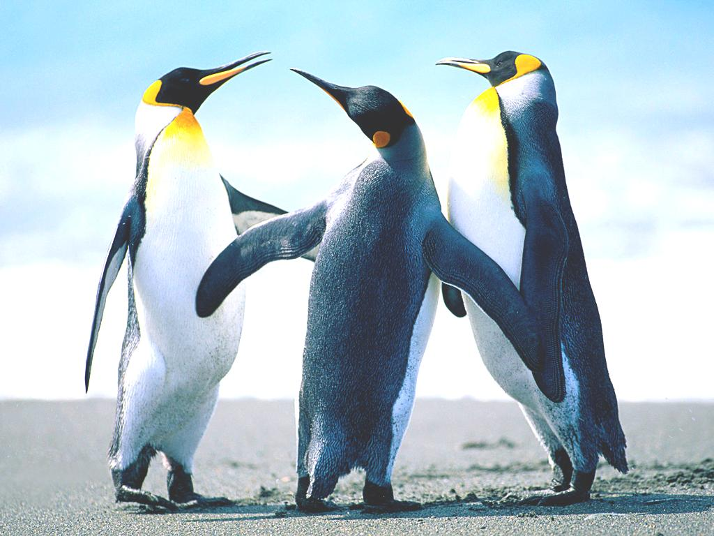
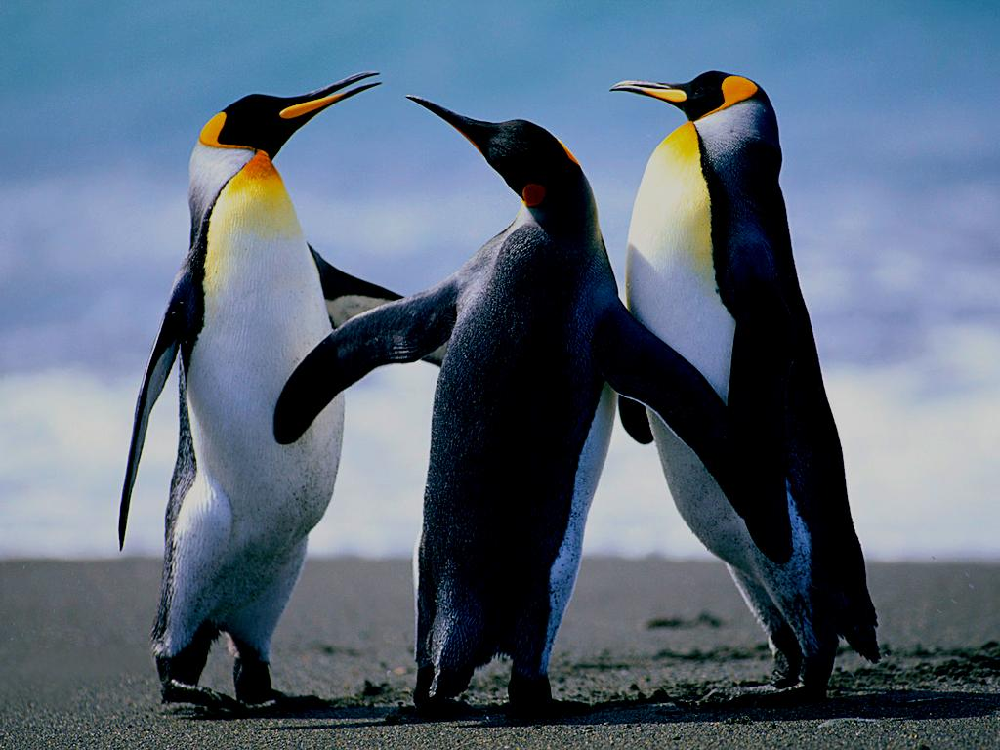
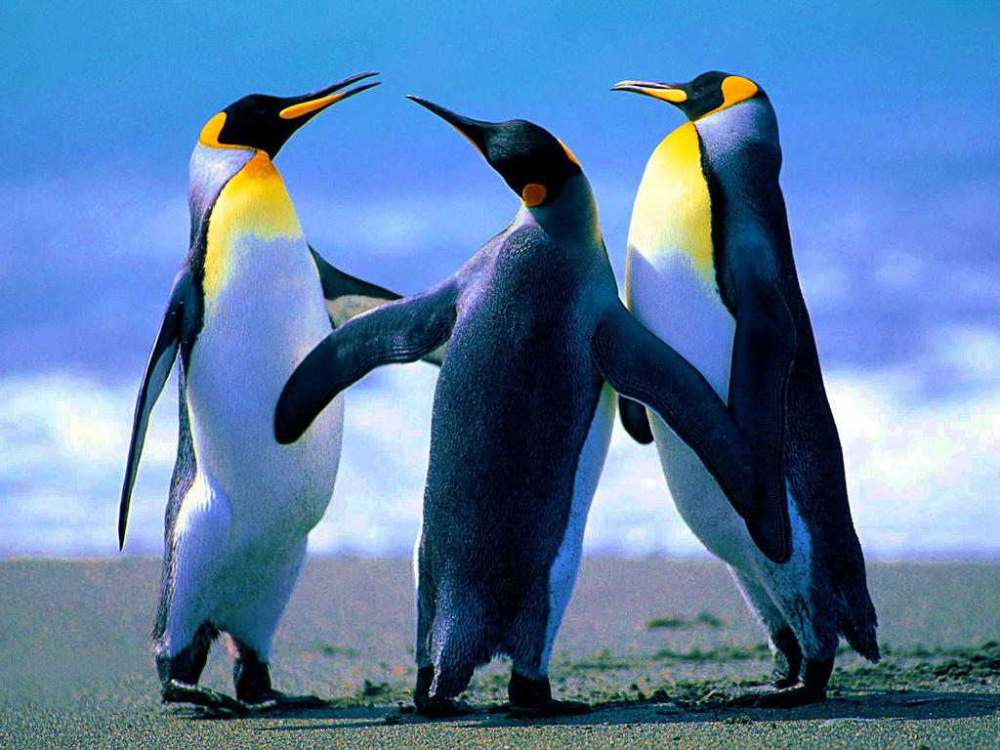

# Image-Processing

Various basic image pocessing techniques implemented in python

## image_brightness Function Defenition

```
image_brightness(PATH:str, bias = [0,0,0], verbose=True)
```

### Inputs 

+ PATH (Str) - path to original image
+ bias (RGB triplet) - brightness offset
+ verbose (True/False)- if True show image on screen

### Outputs

+ PIL Image - containig resulting image
________

### Brightness Results
________

#### Original


________

#### Brightness +50

```
img_contrasted = image_brightness(path = "Data/Penguins.jpg", verbose=True, bias = [50,50,50])
img_contrasted.save("Results/plus_50_brightness.jpg")
```



________

#### Brightness -50

```
img_contrasted = image_brightness(path = "Data/Penguins.jpg", verbose=True, bias = [-50,-50,-50])
img_contrasted.save("Results/minus_50_brightness.jpg")
```



________

## image_saturation Function Defenition

```
image_saturation(PATH:str, saturation = 1, verbose=True)
```

### Inputs 

+ PATH - path to original image
+ saturation - saturation multiplier *can't be 0*
+ verbose - if True show resulting image on screen

### Outputs

+ PIL Image - containig resulting image

________

## Saturation Results

### Original image 


________

### Double Saturation

```
img = image_saturation(PATH = "Data/Penguins.jpg", verbose=True,saturation = [2,2,2])
img.save("Results/double_saturation.jpg")
```



________

### Half Saturation

```
img = image_saturation(PATH = "Data/Penguins.jpg", verbose=True,saturation = [0.5,0.5,0.5])
img.save("Results/half_saturation.jpg")
```


________


