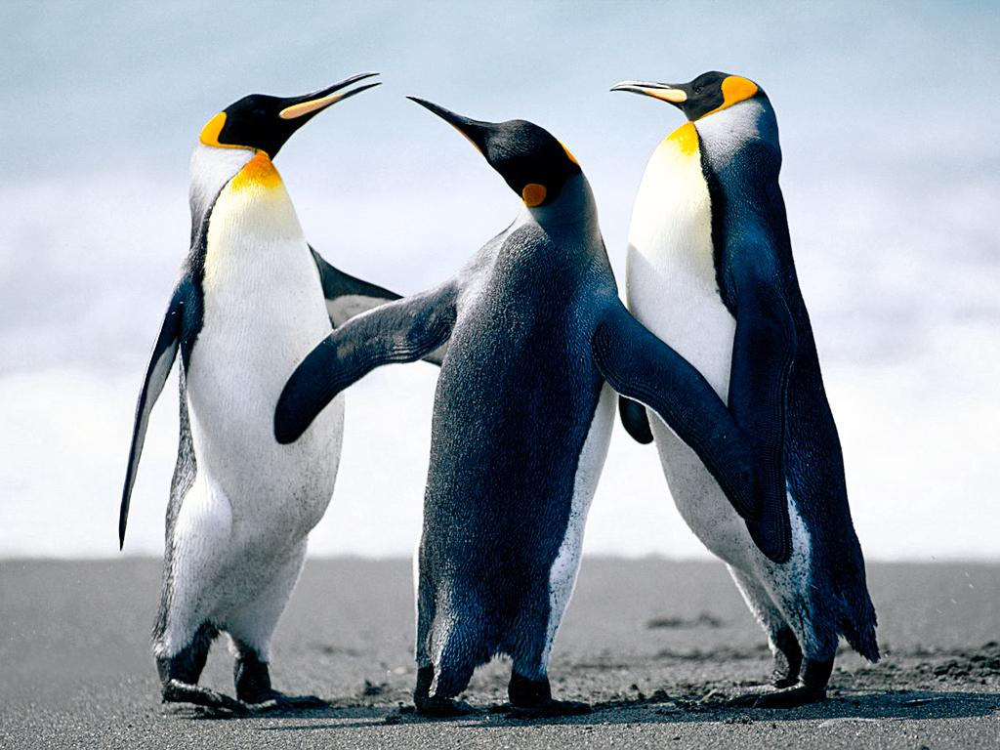
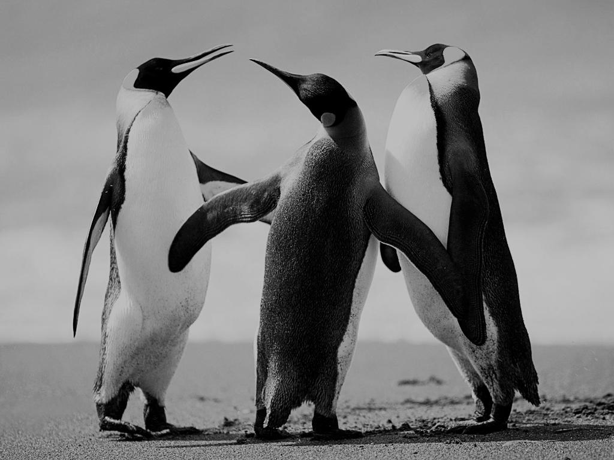

# Image-Processing

Various basic image pocessing techniques implemented in python

________

## image_brightness

```
image_brightness(PATH:str, bias = [0,0,0], verbose=True)
```

### Inputs 

+ PATH (Str) - path to original image
+ bias (RGB triplet) - brightness offset
+ verbose (True/False)- if True show image on screen

### Outputs

+ PIL Image - containig resulting image

### Brightness Results

```
img_contrasted = image_brightness(path = "Data/Penguins.jpg", verbose=True, bias = [50,50,50]) # Brightness +50
img_contrasted = image_brightness(path = "Data/Penguins.jpg", verbose=True, bias = [-50,-50,-50]) # Brightness -50
```

| Original Image                       | Minus 50 brightness                                     | Plus 50 brightness                                    |
|--------------------------------------|---------------------------------------------------------|-------------------------------------------------------|
|  |  |  |

________

## image_saturation

```
image_saturation(PATH:str, saturation = 1, verbose=True)
```

### Inputs 

+ PATH - path to original image
+ saturation - saturation multiplier *can't be 0*
+ verbose - if True show resulting image on screen

### Outputs

+ PIL Image - containig resulting image


## Saturation Results

```
img = image_saturation(PATH = "Data/Penguins.jpg", verbose=True,saturation = [2,2,2])# Double Saturation
img = image_saturation(PATH = "Data/Penguins.jpg", verbose=True,saturation = [0.5,0.5,0.5]) # Half Saturation
```


| Original Image                       | Half Saturation                                 | Double Saturation                                   |
|--------------------------------------|-------------------------------------------------|-----------------------------------------------------|
|  |  |  |
________

## image_contrast

```
image_contrast(PATH:str,factor = [1,1,1], bias = [128,128,128], verbose=True)
```

### Inputs 

+ PATH - path to original image
+ factor - contrasting factor
+ bias - bias of contrasting formula, [128,128,128] for no bias
+ verbose - if True show resulting image on screen

### Outputs

+ PIL Image - containig resulting image


## Contrast Results

```
img_contrasted = image_contrast(PATH = "Data/Penguins.jpg", verbose=True,factor = [2,2,2], bias = [128,128,128]) # Double Contrast
img_contrasted = image_contrast(PATH = "Data/Penguins.jpg", verbose=True,factor = [0.5,0.5,0.5], bias = [128,128,128]) # Half Contrast
```


| Original Image                       | Half Contrast                               | Double Contrast                                 |
|--------------------------------------|---------------------------------------------|-------------------------------------------------|
|  |  |  |

________


## image_grayscale

```
image_grayscale(PATH:str,factor = [1,1,1],verbose=True)
```

### Inputs

+ PATH - path to original image
+ factor - each colors contribution to final color
+ verbose - if True show resulting image on screen

### Outputs

+ PIL Image - containig resulting image


## Grayscale Results

```
factor = [1,1,1]
img = image_grayscale(PATH = "Data/Penguins.jpg", verbose=True,factor = factor)
factor = [3*0.299,3*0.587,3*0.114]
img = image_grayscale(PATH = "Data/Penguins.jpg", verbose=True,factor = factor)
```

| Original Image                       | Grayscale with mean colors                    | Grayscale with different color contributions      |
|--------------------------------------|-----------------------------------------------|---------------------------------------------------|
|  |  |  |

________


## to_palet

```
to_palet(PATH, colors = [0,255], verbose = True)
```

### Inputs

+ PATH - path to original image
+ colors - list of colors to port image to in form of [list(R),list(G),list(B)] or list(Gray)
+ verbose - if True show resulting image on screen

### Outputs

+ PIL Image - containig resulting image


## Grayscale Results

```
palet = [list(range(0,255,25)),list(range(0,255,25)),list(range(0,255,25))]
img = to_palet('Data/Penguins.jpg', colors = palet, verbose = True)

palet = [[54,77,249,245],[48,76,148,245],[98,125,23,245]]
img = to_palet('Data/Penguins.jpg', colors = palet, verbose = True)
```

| Original Image                       | Colors redused to 30                           | Custom color palet                           |
|--------------------------------------|------------------------------------------------|----------------------------------------------|
|  |  |  |


________
